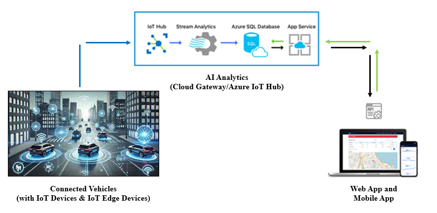

## An Azure IoT Hub-Based Fleet Management System for Connected Vehicles

Abstract—In the transportation domain, vehicles need autonomous technologies such as artificial intelligence, machine learning, and the Internet of Things (IoT), which have revolutionized fleet management systems. This paper proposes an autonomous fleet management system that combines these technologies with web- and mobile-based platforms to enable real-time monitoring, optimization, and decision-making, ensuring that fleets operate autonomously, efficiently, and safely. The system leverages real-time analytics based on data from IoT devices and IoT edge devices. Azure IoT Hub cloud computing enables efficient fleet monitoring, route optimization, predictive maintenance, and decision-making. We present the architecture, design, and development of the proposed system, demonstrating its effectiveness in an urban scenario. The results show significant improvements in operational efficiency, cost reduction, sustainability, and safety. The finding highlights the potential of this approach for the future of autonomous fleet management in various domains, including self-driving cars in urban areas, autonomous mobile robots in logistics, autonomous drones in the air, and autonomous rovers in space exploration.

## Citation:
Angadi, D., Budda, N. and Tammisetty, S., Pilli, Y., Agarwal, V., Suryadevara, B., Ooruchintala, O., Sriramakavacham, R., Killamsetty, R., Kemsaram, N. (2025). **An Azure IoT Hub-Based Fleet Management System for Connected Vehicles**. 2025 Third International Conference on Cyber Physical Systems, Power Electronics and Electric Vehicles (ICPEEV), Hyderabad, India, 2025, pp. 1-6, doi: 10.1109/ICPEEV67897.2025.11291228.
